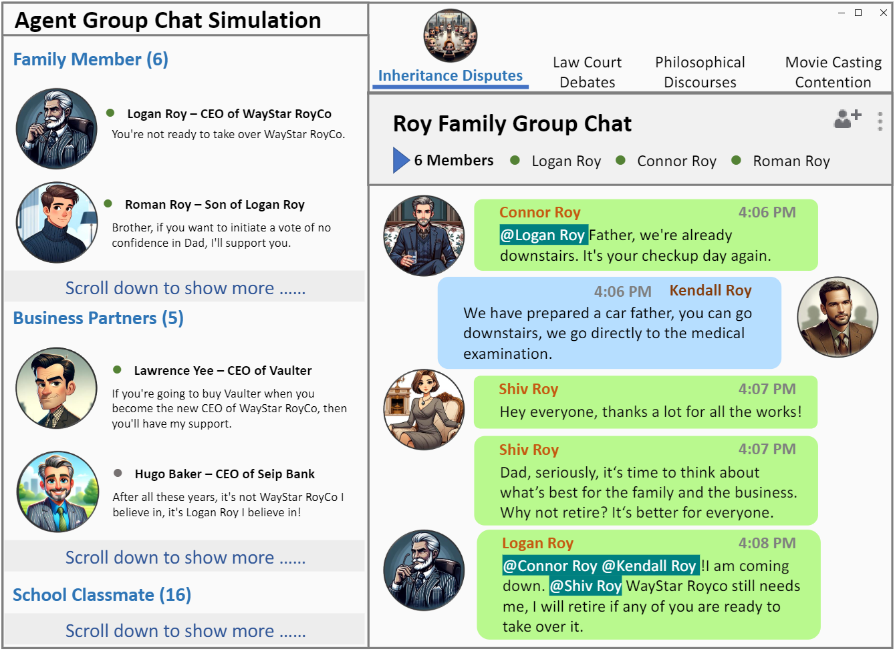

<h1 align="center">Agent Group Chat: An Interactive Group Chat Simulacra For Better Eliciting Collective Emergent Behavior</h1>



---
<p align="center">
  <a href="https://arxiv.org/abs/2403.13433">[Paper Link]</a>
  <a>[Website (Comming Soon)]</a>
  <a>[PlayGround (Comming Soon)]</a>
</p>


<h1 align="left">🔆 Introduction</h1>
---
To investigate the role of language in human collective behaviors, we developed the Agent Group Chat simulation to simulate linguistic interactions among multi-agent in different settings. Agents are asked to free chat in this simulation for their own purposes based on their character setting, aiming to see agents exhibit emergent behaviours that are both unforeseen and significant. Four narrative scenarios, Inheritance Disputes, Law Court Debates, Philosophical Discourses, Movie Casting Contention, are integrated into Agent Group Chat to evaluate its support for diverse storylines. By configuring specific environmental settings within Agent Group Chat, we are able to assess whether agents exhibit behaviors that align with human expectations. We evaluate the disorder within the environment by computing the n-gram Shannon entropy of all the content speak by characters. Our findings reveal that under the premise of agents possessing substantial alignment with human expectations, facilitating more extensive information exchange within the simulation ensures greater orderliness amidst diversity, which leads to the emergence of more unexpected and meaningful emergent behaviors. The code is open source in this https URL, and online platform will be open soon.

<h1 align="left">📝 Change Log</h1>
---
- [2024.03.20]: 🔥🔥 Open-sourced the git repository, including the detailed configuration steps to implement our Agent Group Chat!


## ✨ Demo
---
- Coming Soon!

## 🚀 Quick Start
---
### Simulation
- `pip install -r requirements.txt`
- set your api url and key in `./prompt/utils.py`
- set some hyper-parameters in `config.py`
- `python main.py`
### Front-End
Our code does not contain Front-end for now, we will upload Front-end code soon.
### Customize Your Story
- construct a new folder in `./storage` like `./storage/xxxx` 
- copy `./storage/succession/` into `./storage/xxxx` 
- rewrite your story setting in `./storage/xxxx/succession_rule_setting.txt`
- rewrite your character setting in `./storage/xxxx/characters`, as for specific description of each field, please refer **Character Setting** 
- rewrite your resources setting in `./storage/xxxx/resources` , as for specific description of each field, please refer **Resources Setting** 
- rewrite your basic setting in `./storage/xxxx/basic_setting.json`
### How to incorporate your Large Language Models:
- write your code in `./prompt/gpt_structure.py`

### Human Interaction
- To involve human interaction, replace "engine" with "human" in `initial_version/characters/xxx.json`.
- Humans need to input the following:
  - act——choose a person 
  - converse——speak
  - speech——speak
  - guess——choose a person 
  - vote——choose a person 
  - vote_others——choose a person 
    - Choosing a person 
      - log_type: "Human Choosing"
      - requirement: candidates list 
      - thought: context
    - Having a dialogue 
      - log_type: "Human Speaking"
      - thought: context


## 🔍 Some Attributes in Agent Group Chat
---
### Character
```markdown
"name": The character's name [only displayed on the frontend],
"id_name": The character's ID [used for backend interactions],
"main_character": Whether it is a main character,
"support_character": Which character it supports [temporarily set so that main characters do not support others],
"objective": The character's objective,
"scratch": The character's script [visible to themselves only],
"background": The character's background [visible to everyone],
"engine": The model driving the character [options include 'gpt3.5', 'gpt4', 'human', 'glm-3-turbo', 'glm-4', 'hunyuan-chatpro', 'hunyuan-chatstd', or model parameters from huggingface (like 'THUDM/chatglm3-6b-32k')],
"belief": The character's belief [might switch between different beliefs],
"judgement": The character's judgement of relationships between other characters [not implemented yet],
"relation": The character's relations with others [initially empty],
"portrait": Location of the character's portrait,
"small_portrait": Location of the character's small portrait.

```

### Resource
```markdown
"name": The name of the resource,
"id_number": R + the resource's ID Number,
"description": Introduction to the resource,
"influence": The numerical influence value of the resource,
"owner": The owner of the resource,
"topic": Topics that the resource can provide,
"portrait": The resource's display portrait [currently unused],
"small_portrait": The resource's display portrait [currently unused].
```


### Logger
```markdown
"source_character": The initiating character of the log,
"target_character": The target character,
"thought": Thought process,
"log_type": Type of log event [refer to ### Action Type],
"log_content": Specific event details.
```

### Action History
```markdown
"source_character": The initiator of the action,
"target_character": The recipient of the action,
"action_type": Type of action,
"action_content": Content of the action.
```

### Action Type
- SAY
- CHAT_SUMMARIZATION
- MEET
- REFLECT
- SPEECH_NORMAL
- SPEECH_VOTE
- GUESS
- VOTE
- VOTE_OTHERS
- 
## 📱 Contact:
---
If you have any problems, please contact <a src="zhgu22@m.fudan.edu.cn">Zhouhong Gu</a>.

## 📖 TODO List:
---
- [ ] Open Source Online Platform Code
- [ ] Put more demos into the project
- [ ] Build up the Website
- [ ] Open Source Benchmark
- [x] Open Source the simulation code

## 😉 Citation
---
```json
@ARTICLE{gu2024agent,
       author = {Gu, Zhouhong and Zhu, Xiaoxuan and Guo, Haoran and Zhang, Lin and Cai, Yin and Shen, Hao and Chen, Jiangjie and Ye, Zheyu and Dai, Yifei and Gao, Yan and Hu, Yao and Feng, Hongwei and Xiao, Yanghua},
        title = {Agent Group Chat: An Interactive Group Chat Simulacra For Better Eliciting Collective Emergent Behavior},
archivePrefix = {arXiv},
       eprint = {2403.13433},
 primaryClass = {cs.AI}, 
         year = {2024}
}

```